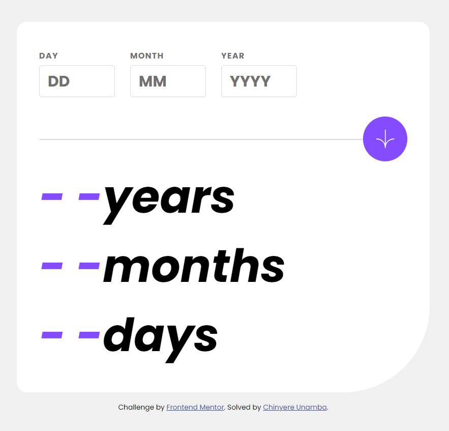

# Frontend Mentor - Age calculator app

## Welcome! 👋

[Frontend Mentor](https://www.frontendmentor.io) challenges help you improve your coding skills by building realistic projects.

**To do this challenge, you need a decent understanding of HTML, CSS and JavaScript.**

## The challenge

Your users should be able to: 

- View an age in years, months, and days after submitting a valid date through the form
- Receive validation errors if:
  - Any field is empty when the form is submitted
  - The day number is not between 1-31
  - The month number is not between 1-12
  - The year is in the future
  - The date is invalid e.g. 31/04/1991 (there are 30 days in April)
- View the optimal layout for the interface depending on their device's screen size
- See hover and focus states for all interactive elements on the page
- **Bonus**: See the age numbers animate to their final number when the form is submitted

### Solved by Chinyere Unamba
### View site [Age calculator app](https://keen-gumdrop-27f6bc.netlify.app/)
<!-- 
## Sharing your solution

There are multiple places you can share your solution:

1. Share your solution page in the **#finished-projects** channel of the [Slack community](https://www.frontendmentor.io/slack). 
2. Tweet [@frontendmentor](https://twitter.com/frontendmentor) and mention **@frontendmentor**, including the repo and live URLs in the tweet. We'd love to take a look at what you've built and help share it around.
3. Share your solution on other social channels like LinkedIn.
4. Blog about your experience building your project. Writing about your workflow, technical choices, and talking through your code is a brilliant way to reinforce what you've learned. Great platforms to write on are [dev.to](https://dev.to/), [Hashnode](https://hashnode.com/), and [CodeNewbie](https://community.codenewbie.org/).
 -->
